# Authentication Flow Documentation - ASTRAIL

This document outlines the detailed **OAuth 2.0 / OpenID Connect (OIDC) Authorization Code Flow** configured within the system, consisting of:
*   **React Frontend (Web App)** running on port `5173`.
*   **API Gateway (BFF)** running on port `8080`.
*   **Identity Service (Auth Server)** running on port `9000`.
*   **Postgres Database** storing users and registered client configurations.

---

## 1. Sequence Diagram

Below is the step-by-step interaction sequence between the User, Browser, Gateway, Auth Server, and Database:

```mermaid
sequenceDiagram
    autonumber
    actor User as User
    participant Browser as User Browser
    participant UI as React Frontend (5173)
    participant GW as API Gateway (8080)
    participant AS as Auth Server (9000)
    participant DB as Postgres Database

    %% --- Phase 1: Authentication Trigger ---
    User->>UI: Access App & Click "Login"
    UI->>Browser: Redirect to Gateway: http://localhost:8080/oauth2/authorization/gateway
    Browser->>GW: GET /oauth2/authorization/gateway
    Note over GW,AS: Gateway generates PKCE values & redirects to Auth Server
    GW-->>Browser: 302 Redirect to Auth Server /api/auth/authorize
    Browser->>AS: GET /api/auth/authorize?response_type=code&client_id=my-client-gateway&scope=openid%20read&redirect_uri=...

    %% --- Phase 2: User Login at Auth Server ---
    AS->>AS: Verify User Session
    Note over AS: Unauthenticated -> Redirect to Login Form
    AS-->>Browser: 302 Redirect to /login
    Browser->>AS: GET /login (Request login page)
    AS-->>Browser: Serve login.html template (200 OK)
    User->>Browser: Enter Credentials & Submit
    Browser->>AS: POST /login (username, password, remember-me)

    %% --- Phase 3: Credentials Validation ---
    AS->>DB: Query user records in 'users' & 'authorities' tables
    DB-->>AS: Return BCrypt password hash & Roles
    AS->>AS: Validate password (BCrypt verification)
    AS-->>Browser: 302 Redirect back to Saved Request (/api/auth/authorize)

    %% --- Phase 4: Code Issuance & Token Exchange ---
    Browser->>AS: GET /api/auth/authorize (Authenticated)
    Note over AS: requireAuthorizationConsent = false (Bypass Consent screen)
    AS-->>Browser: 302 Redirect to Client Redirect URI with Authorization Code
    Note over Browser,GW: http://127.0.0.1:8080/login/oauth2/code/gateway?code=AUTH_CODE
    Browser->>GW: GET /login/oauth2/code/gateway?code=AUTH_CODE

    rect rgb(30, 41, 59)
        Note over GW,AS: Back-channel token exchange
        GW->>AS: POST /api/auth/token (Basic Auth: Client ID + Secret, code)
        AS->>DB: Validate Authorization Code & Client registration
        DB-->>AS: Client credentials valid
        AS->>AS: Issue Access Token (JWT), ID Token & Refresh Token
        AS-->>GW: Return Tokens (200 OK)
    end

    %% --- Phase 5: Session Establishment ---
    GW->>GW: Create Local Session (Cookie Session) for user
    GW-->>Browser: 302 Redirect to React Frontend (5173) with Session Cookie
    Browser->>UI: Load React Frontend Home Page (Authenticated)

    %% --- Phase 6: Secured API Requests ---
    UI->>Browser: Fetch telemetry through Gateway: GET /api/test/user
    Browser->>GW: GET /api/test/user (with Gateway Session Cookie)
    GW->>GW: TokenRelay filter extracts Access Token (JWT) from Session
    GW->>AS: Forward request with header: Authorization: Bearer JWT
    AS-->>GW: API Telemetry Response Data (200 OK)
    GW-->>UI: Return data to frontend UI
```

---

## 2. Detailed Steps Explanation

### Phase 1: Authentication Trigger (Client/Gateway)
1.  The user visits the **React UI** and clicks "Login".
2.  The React app redirects the browser to the secured endpoint on the **Gateway (BFF)**.
3.  The Gateway prepares the parameters for the **Authorization Code Flow**:
    *   Generates a `state` parameter to prevent CSRF attacks.
    *   Constructs the authorization redirect pointing to the Auth Server (`http://localhost:9000/api/auth/authorize`).
4.  The Gateway responds, redirecting the browser to the Auth Server.

### Phase 2: User Login (Auth Server)
5.  The browser sends a request to the Auth Server authorization endpoint with query parameters: `client_id`, `response_type=code`, `redirect_uri`, and `scope`.
6.  The Auth Server detects that the user is unauthenticated (`SecurityContext` is empty).
7.  The Auth Server redirects the browser to the custom login page `/login`.
8.  The browser requests `GET /login` and renders the [login.html](file:///e:/astrail/src/services/identity-service/src/main/resources/templates/login.html) form.
9.  The user enters credentials and submits the login form via `POST /login`.

### Phase 3: Credentials Validation
10. The Auth Server's `DaoAuthenticationProvider` queries the database via `CustomUserDetailService` to load the user's encrypted credentials.
11. The password encoder validates the plaintext password against the brypted hash.
12. Once validated, a successful session is established on the Auth Server (generating a `JSESSIONID` cookie), and the server redirects back to the original saved authorization request.

### Phase 4: Code Issuance & Token Exchange
13. The browser calls `GET /api/auth/authorize` again (this time carrying the active Auth Server session cookie).
14. Because the client configuration has `.requireAuthorizationConsent(false)` in the database, the Auth Server skips the consent approval screen.
15. The Auth Server generates a one-time, short-lived **Authorization Code** and redirects the user's browser back to the registered `redirect_uri` of the client Gateway.
16. The browser loads the Gateway callback URL: `/login/oauth2/code/gateway?code=XYZ_AUTH_CODE`.
17. The Gateway intercepts the request, grabs the `code`, and initiates a direct back-channel HTTP `POST` to the Auth Server's token endpoint (`/api/auth/token`).
18. The Auth Server validates the client using Basic HTTP Authentication (verifying `client_id` and `client_secret` of the Gateway) and validates the authorization code.
19. Upon verification, the Auth Server responds with:
    *   `access_token`: A signed JWT containing user information and roles (`ROLE_USER`).
    *   `id_token`: An OIDC payload representing the authenticated subject's profile.
    *   `refresh_token`: A token used to periodically renew access tokens.

### Phase 5 & 6: Session Establishment & Token Relay
20. The Gateway receives the tokens, registers them in its local session cache, sets a secure session cookie on the browser, and redirects the user back to the React UI (`http://localhost:5173`).
21. For subsequent API requests, the React UI queries the Gateway (e.g., `GET /api/test/user`) with the Gateway's session cookie.
22. The Gateway's `TokenRelay` filter intercepts the request, retrieves the access token (JWT) from its session cache, and forwards the request to downstream services with the header `Authorization: Bearer <JWT>` for verification.
